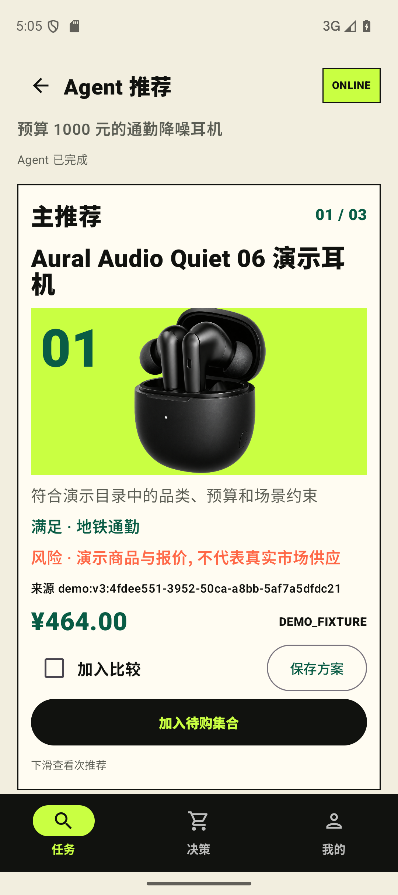
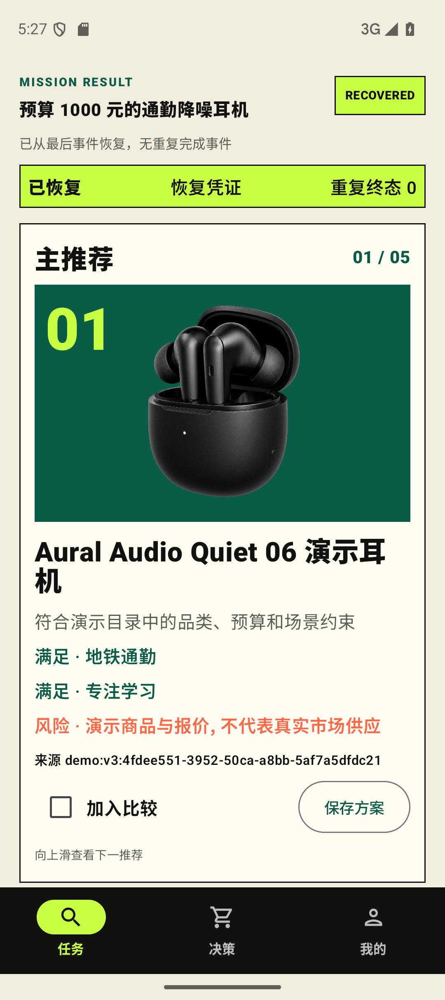
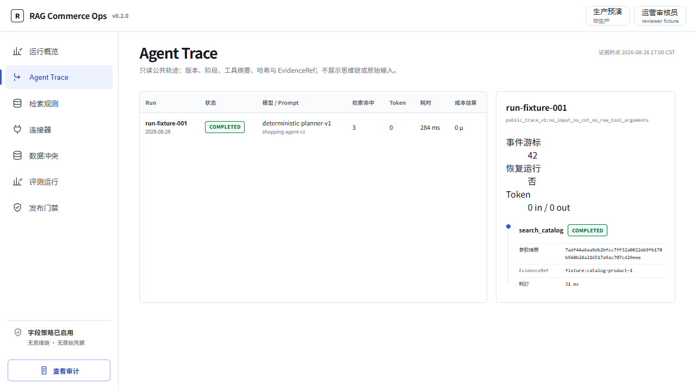

# RAG Commerce Shopping Agent V3

[](https://github.com/JunyeFu/Rag-ecommerce-agent/actions/workflows/ci.yml)
[](LICENSE)


一个 Android 原生、证据可追溯、操作需审批的 RAG 电商导购 Agent：从购买任务出发，完成澄清、混合检索、工具调用、候选比较、待购决策与恢复。

> English abstract — A native Android shopping Agent backed by hybrid RAG, ten typed tools, durable jobs, resumable SSE, evidence-bound recommendations, explicit action approval, and an operations console.



[观看 87 秒 Android 演示：提问、Agent 推荐、纵向候选与三入口切换](docs/media/rag-commerce-v3-demo.mp4)

## 三分钟看懂

用户不是在浏览一版缩小的商城首页，而是在执行一条 Shopping Mission。单管理 Agent 只负责结构化计划、澄清和解释；执行器负责工具 Schema、权限、幂等、预算与审计。商品与商业事实只能来自工具证据，演示报价永久标记为 `DEMO_FIXTURE`。

```text
Android → API 写入 Turn/Job → Worker 领取
        → Agent + 10 个类型化工具 → PostgreSQL 事件日志
        → SSE / ThreadSnapshot → Android + Ops

检索：BM25 + 向量 + 结构化过滤 → RRF 融合 → EvidenceRef
```

核心技术栈：Kotlin、Jetpack Compose、Room、FastAPI、LangGraph、PostgreSQL、Qdrant、MinIO、Redis、React、TypeScript、OpenAPI、OpenTelemetry。

## 当前证据

| 层级 | 当前结果 | 含义 |
|---|---:|---|
| 60 SKU / 10 黄金场景 fixture | Recall@10 `1.00`、NDCG@10 `1.00` | 项目自有数据上的确定性开发基线，不是真实模型结论 |
| MiMo `mimo-v2.5` 真实评测 | `PASS — 10/10 parseable` | Schema 100%、流程 9/10、证据 100%、零越权、零商业事实伪造；平均场景延迟 65.8 秒 |
| 作品集发布 | `GO` | [PR #26](https://github.com/JunyeFu/Rag-ecommerce-agent/pull/26) 四项 CI 全绿，已合入 `main` 并发布 [v0.3.0](https://github.com/JunyeFu/Rag-ecommerce-agent/releases/tag/v0.3.0) |
| 商业发布 | `NO_GO` | 缺联盟授权、LIVE 报价、物理设备、双人盲评与生产安全/法律门禁 |

真实评测与 fixture 使用不同报告；Provider 失败不会静默切换 fake。通过报告见 [MiMo run-009](docs/evidence/v3/mimo-v2.5-real-evaluation-run-009.json)，详细边界见 [发布矩阵](docs/release/release-gate-matrix.json) 和 [求职收口任务包](docs/task-packages/packages/V3-PORTFOLIO-CLOSE-01/TASK.md)。

## 三条快速启动命令

要求：Python 3.12.11、uv 0.11.13、Node 24.15.0、npm 12.0.1、Java 17、Docker 与 Android SDK。

```powershell
git clone https://github.com/JunyeFu/Rag-ecommerce-agent.git; Set-Location Rag-ecommerce-agent
./scripts/bootstrap.ps1 -Quick
./scripts/start_v3_demo.ps1
```

启动后，Ops 位于 `http://127.0.0.1:24174`；Android debug APK 固定访问模拟器宿主 `http://10.0.2.2:8080/`，不提供离线 fixture 回退。

## Agent 闭环

1. Android 创建购买 Mission，提取预算、用途、硬约束、排除项和待澄清字段。
2. Agent 调用商品检索、事实、报价、比较、清单、待购、重新询价和链接解析等十个冻结工具。
3. 结构化商品卡展示匹配理由、不满足项、风险、EvidenceRef 与报价等级；主、次、再次推荐纵向浏览。
4. 可逆写入和外部跳转必须审批；重复请求由幂等键约束。
5. Worker 重启或 SSE 断线后从持久化游标恢复，不重复终态事件。



## 工程质量与设计取舍

- 单 Agent 而非多 Agent：边界更清晰，Trace 和失败归因更可讲。
- PostgreSQL durable job 而非 Kafka：满足单人作品集的恢复与并发目标，避免无证据的基础设施膨胀。
- 只保留必要防线：HTTPS/过期链接、审批与幂等、SSE 恢复、Worker 租约、媒体补偿和商业事实约束。
- 删除旧商城 UI、静态 Ops 数据、未接入传输层的通用韧性模块和许可待定旧 seed；窄范围 minimality CI 防止回归。
- 公共 API 契约版本独立为 `0.2.0`，产品版本为 `0.3.0`。



## 面试讲解入口

- [C4 架构](docs/architecture/V3-C4.md)
- [Agent 时序](docs/architecture/V3-AGENT-SEQUENCE.md)
- [五分钟演示脚本](docs/demo/V3-FIVE-MINUTE-DEMO.md)
- [二十分钟系统设计讲解](docs/demo/V3-SYSTEM-DESIGN-INTERVIEW.md)
- [检索与评测方法](docs/evaluation/methodology.md)
- [任务包与证据清单](docs/task-packages/manifest.json)

## License

MIT 覆盖本项目自有源码、60 SKU 演示数据和项目生成美术资产；第三方依赖继续遵循各自许可证。所有商品、商家与报价均为演示 fixture，不代表真实市场供应。
