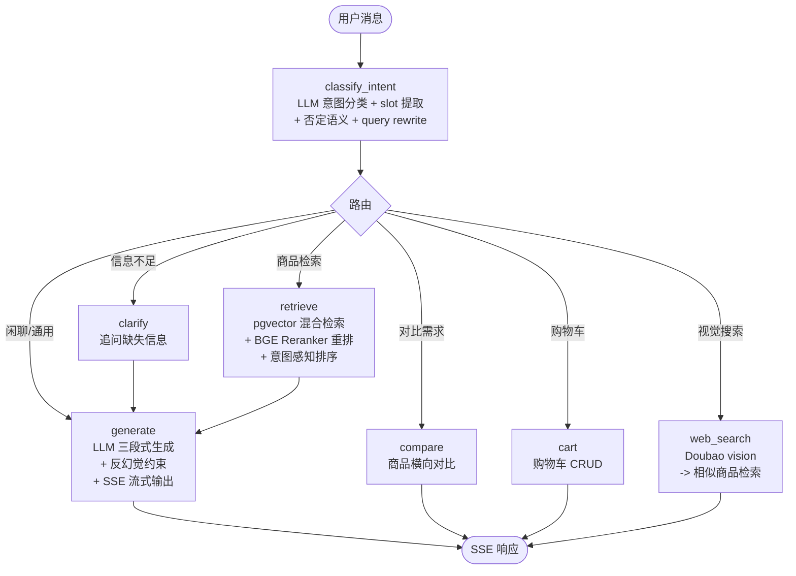
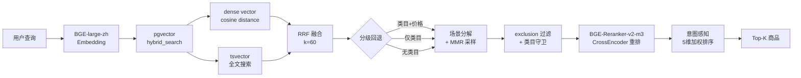

# 拾物 - RAG 多模态电商导购 AI Agent

> 基于 RAG + LangGraph + pgvector 的智能导购系统，覆盖"意图理解 -> 智能咨询 -> 决策辅助 -> 交易执行"全链路闭环。

## 项目概述

拾物是一个多模态电商导购 AI Agent，通过自然语言对话帮助用户完成商品推荐、条件筛选、多轮追问、商品对比、场景化推荐、拍照搜物、语音搜索等 9 级导购场景。系统采用 LangGraph StateGraph 编排 Agent 工作流，结合 pgvector 混合检索（向量 + 全文搜索 + 结构化过滤）和 BGE Reranker 重排序，实现意图感知的精准商品推荐。

| 指标 | 数据 |
|------|------|
| 商品数据 | 287 条商品，94 个细分类目 |
| 后端 | 104 个 Python 文件，FastAPI + LangGraph |
| 前端 | 73 个 Kotlin 文件，Android 原生 Jetpack Compose |
| APK | 24.1 MB（Debug 编译通过） |
| 单元测试 | 101 个 pytest 用例 |

## 技术栈

| 层 | 技术 | 说明 |
|----|------|------|
| Agent 编排 | LangGraph StateGraph | 7 节点 + 条件路由 |
| 后端框架 | FastAPI | 异步 ASGI，SSE 流式输出（8 事件类型） |
| 向量检索 | PostgreSQL + pgvector | 1024-dim，cosine distance，ivfflat 索引 |
| 全文搜索 | PostgreSQL tsvector | title(A) + description(B) + category(C) 权重，GIN 索引 |
| Embedding | BGE-large-zh-v1.5 | 中文语义向量，CPU 推理 |
| Reranker | BGE-Reranker-v2-m3 | CrossEncoder，sigmoid 归一化 |
| LLM | Doubao-Seed-2.0-lite | 火山方舟 API |
| 数据库 | PostgreSQL | 结构化存储 + 向量列 + 全文搜索一体化 |
| 前端 | Kotlin + Jetpack Compose | Android 原生 |

> 检索管线为自研实现（pgvector 原生 SQL + BGE CrossEncoder + 意图感知多维排序），未使用 LlamaIndex/LangChain AgentExecutor。

## 架构概览

```
Android (Kotlin/Compose)
    ↕  SSE + REST
FastAPI (16 routes)
    ↕
LangGraph StateGraph (7 nodes)
    ↕
RAG Pipeline (embed -> hybrid_search -> rerank -> rank)
    ↕
PostgreSQL + pgvector (向量 + 结构化 + 全文搜索) + Doubao LLM
```

### LangGraph 工作流



| 节点 | 职责 |
|------|------|
| `classify_intent` | LLM 意图分类 + slot 提取 + 否定语义 + query rewrite |
| `clarify` | 追问缺失关键信息 |
| `retrieve` | pgvector 混合检索 + 分级回退 + MMR 采样 + exclusion 过滤 + BGE rerank |
| `generate` | LLM 三段式生成 + 反幻觉约束 + SSE 流式输出 |
| `cart` | 购物车操作（查看/添加/修改/删除/结算） |
| `compare` | 商品对比 |
| `web_search` | 视觉搜索（图片上传 -> Doubao vision -> 相似商品检索） |

### RAG 检索管线

```
query -> embed_text (BGE-large-zh)
      -> pgvector hybrid_search (dense vector <=> + tsvector @@ RRF 融合)
      -> 分级回退 (类目+价格 -> 类目 -> 无类目)
      -> 场景分解 + 类目感知 MMR 采样
      -> exclusion 过滤 + 类目守卫
      -> BGE-Reranker-v2-m3 重排
      -> intent-aware 5 维加权排序
         (semantic*0.4 + price*0.2 + rating*0.15 + brand*0.1 + attributes*0.15)
```

<details>
<summary>RAG 检索流程图（点击展开）</summary>



</details>

## 功能覆盖

| # | 场景 | 说明 |
|---|------|------|
| 1 | 对话推荐 | 自然语言商品推荐，SSE 流式输出 |
| 2 | 条件筛选 | 价格/品牌/类目等多维度过滤 |
| 3 | 多轮追问 | Agent 主动澄清缺失信息 |
| 4 | 商品对比 | 多商品横向对比决策 |
| 5 | 主动反问 | 槽位不足时主动追问 |
| 6 | 否定排除 | "不要红色" -> 精准排除红色商品 |
| 7 | 场景化推荐 | "露营装备" -> 多品类组合推荐 |
| 8 | 购物车管理 | 对话式购物车 CRUD |
| 9 | 拍照搜物 | 图片上传 -> 视觉理解 -> 相似商品 |

## 快速开始

> 完整搭建指南：[`docs/standards/SETUP.md`](docs/standards/SETUP.md)

### 前置条件

- Python 3.11+、Docker 24+、Git 2.40+
- Android Studio + JDK 17（编译前端）
- HuggingFace 模型：BGE-large-zh-v1.5 + BGE-Reranker-v2-m3（共 ~3.5GB）

### 启动步骤

```bash
# 1. 克隆仓库
git clone https://github.com/fujunye-company/rag-ecommerce-agent.git
cd rag-ecommerce-agent

# 2. 启动 PostgreSQL
docker compose -f infrastructure/docker-compose.yml up -d

# 3. 配置后端环境
cd apps/backend
cp .env.example .env   # 填入 DOUBAO_API_KEY 等

# 4. 安装依赖
python -m venv .venv && source .venv/bin/activate   # Windows: .venv\Scripts\activate
pip install -r requirements.txt

# 5. 启动后端（含自动数据导入 pgvector）
uvicorn app.main:app --reload --host 0.0.0.0 --port 8080

# 6. 编译 Android
cd ../android && ./gradlew assembleDebug
```

### Make 快捷方式

```bash
make install    # 安装 Python 依赖
make dev        # 启动后端开发服务器
make docker-up  # 启动 Docker 基础设施
make test       # 运行测试
make seed       # 数据导入
```

## 项目结构

```
rag-ecommerce-agent/
├── apps/
│   ├── backend/              FastAPI 后端（104 .py）
│   │   ├── app/
│   │   │   ├── api/          16 个 API 路由模块
│   │   │   ├── services/     27 个服务（agent/retriever/reranker/ranker...）
│   │   │   ├── core/         配置与数据库
│   │   │   ├── models/       SQLAlchemy 数据模型
│   │   │   └── main.py       FastAPI 入口
│   │   ├── tests/            101 个 pytest 用例
│   │   └── data/             商品数据（287 条 JSONL）
│   └── android/              Kotlin Compose Android（73 .kt）
│       └── app/src/main/java/com/shopping/agent/
│           ├── ui/           屏幕/组件/主题/导航
│           ├── data/         远程/本地/TTS/语音/Mock
│           └── viewmodel/    ChatViewModel/CartViewModel
├── docs/                     项目文档
├── infrastructure/           docker-compose + env
├── Makefile                  快捷命令
└── README.md
```

## 文档

### 开发权威

- **[DEV-CONTROL.md](docs/DEV-CONTROL.md)** - 开发权威入口，技术栈/命令/架构/规范/数据契约的唯一权威来源

### 架构与接口

- [ARCHITECTURE.md](docs/ARCHITECTURE.md) - 系统架构、Agent 工作流、SSE 协议、数据流
- [API.md](docs/API.md) - 后端 API 接口文档
- [DATA-CONTRACT.md](docs/standards/DATA-CONTRACT.md) - 前后端数据契约
- [MECHANISM.md](docs/standards/MECHANISM.md) - 全链路机制设计

### 开发规范

- [DEV-GUIDE.md](docs/standards/DEV-GUIDE.md) - 开发总纲、系统目标与创新约束
- [开发规约-v2.md](docs/standards/开发规约-v2.md) - 命名/代码/测试/提交规范
- [SETUP.md](docs/standards/SETUP.md) - 从零搭建详细指南
- [DESIGN.md](docs/standards/DESIGN.md) - UI 设计规范

### 性能与研究

- [PERFORMANCE.md](docs/notes/PERFORMANCE.md) - 性能基准
- [TTFT_BENCHMARK.md](docs/optimization/TTFT_BENCHMARK.md) - 延迟与 TTFT 基准
- [RAG 调研报告](docs/research/rag-framework-research-report.md) - RAG 框架选型分析
- [INNOVATION-RESEARCH.md](docs/optimization/INNOVATION-RESEARCH.md) - 技术创新点研究

## 性能指标

| 指标 | 目标 | 实际 |
|------|------|------|
| TTFT（首字延迟） | < 1s | ~1.5s |
| SSE 吞吐 | ≥ 20 tok/s | 达标 |
| 检索延迟 | < 2s | ~1s |
| 冷启动 E2E | < 15s | ~11s |
| 热缓存命中 | - | ~16ms |

## 作者

| 成员 | 职责 |
|------|------|
| 傅钧烨 | Agent 框架设计、主线模块实现、全栈开发 |
