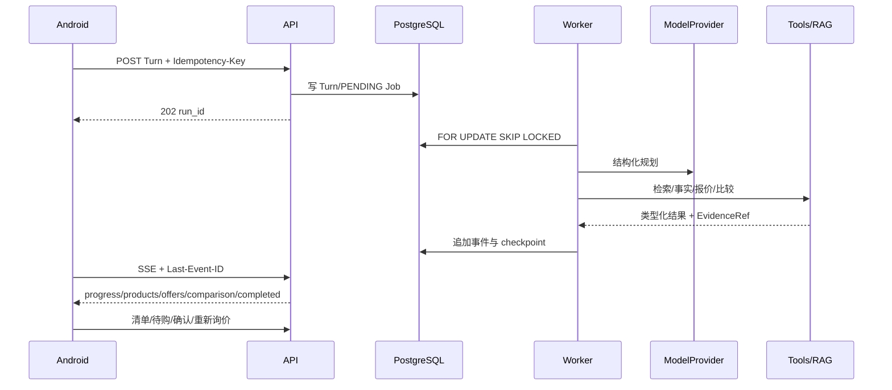

# V3 Agent 时序

```mermaid
sequenceDiagram
  participant A as Android
  participant API as API
  participant DB as PostgreSQL
  participant W as Worker
  participant M as ModelProvider
  participant T as Tools/RAG
  A->>API: POST Turn + Idempotency-Key
  API->>DB: 写 Turn/PENDING Job
  API-->>A: 202 run_id
  W->>DB: FOR UPDATE SKIP LOCKED
  W->>M: 结构化规划
  W->>T: 检索/事实/报价/比较
  T-->>W: 类型化结果 + EvidenceRef
  W->>DB: 追加事件与 checkpoint
  A->>API: SSE + Last-Event-ID
  API-->>A: progress/products/offers/comparison/completed
  A->>API: 清单/待购/确认/重新询价
```

只公开阶段与结构化结果，不公开思维链。可逆写操作和外部跳转都需要显式确认。
