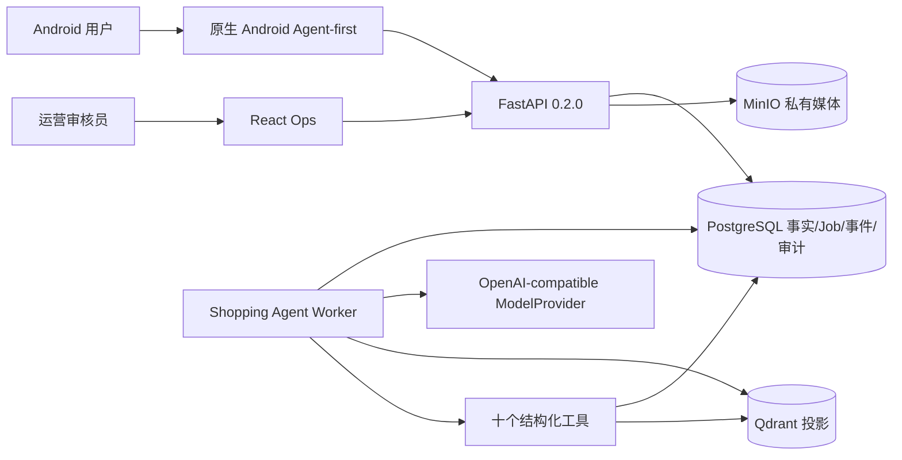

# V3 C4 架构

```mermaid
flowchart LR
  User[Android 用户] --> Android[原生 Android Agent-first]
  Reviewer[运营审核员] --> Ops[React Ops]
  Android --> API[FastAPI 0.2.0]
  Ops --> API
  API --> PG[(PostgreSQL 事实/Job/事件/审计)]
  Worker[Shopping Agent Worker] --> PG
  Worker --> Model[OpenAI-compatible ModelProvider]
  Worker --> Q[(Qdrant 投影)]
  API --> MinIO[(MinIO 私有媒体)]
  Worker --> Tools[十个结构化工具]
  Tools --> PG
  Tools --> Q
```

PostgreSQL 是事务事实源；Qdrant 是可重建投影；Redis 只允许限流和短缓存；MinIO 对象由 TTL 清理。模型不能直接写状态，执行器拥有 Schema、权限、幂等、预算和审计。
